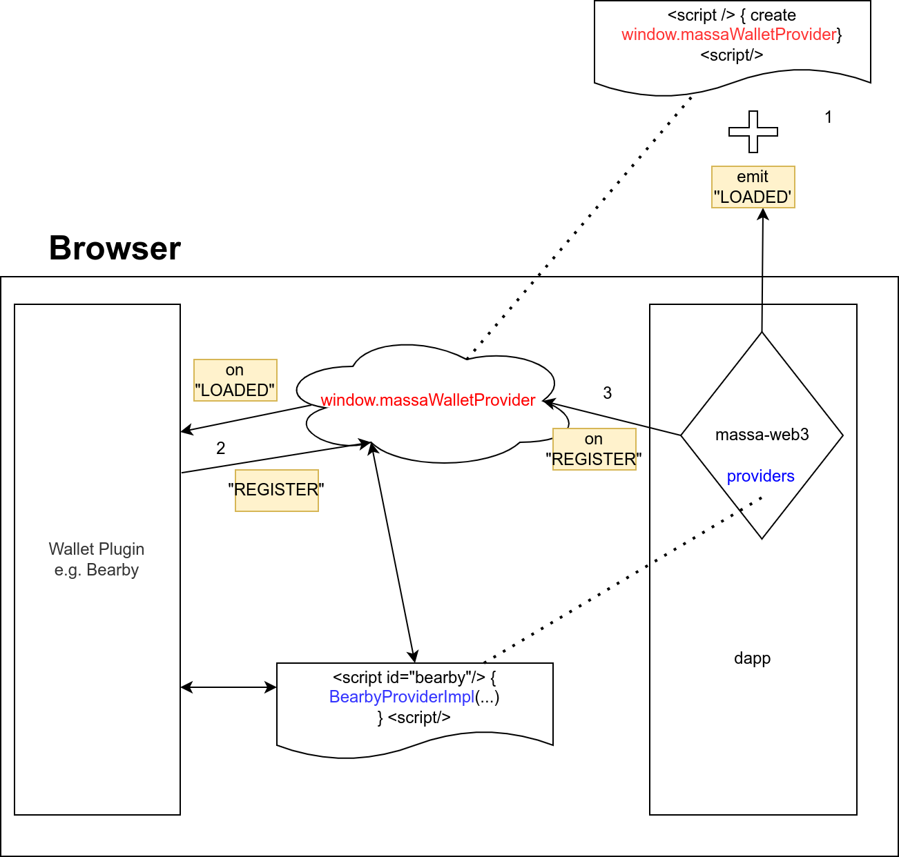

# Wallet-DApp communication standard

Initial meta issue: <https://github.com/massalabs/massa-standards/issues/13>

## Abstract

The idea of this RFC is to propose a general standardas well as the mechanics behind it for communication between wallets (Thyra, Bearby, any external wallet) and massa-web3 such that both:
- Dapp creators could have a unified interface they could make use of in their dapps which would allow them to easily switch to another compatible to the standard wallet client if they need to without breaking a single line of code in their Dapps.
- Wallets (light or heavy) could implement the corresponding wallet standard and expose themselves for direct use this way ensuring that any massa dapp could make use of them or easily switch to them if needed.

## Motivation

## Specification

For the realization of this RFC we will need Wallet Side and Dapp Side interfaces, wallet registry and discovery by web3.

To illustrate the concepts more clearly, we would use the following diagram for better understanding

Each step is described below and also indicated on the diagram.


1. the dapp on the right would make use of the `massa-web3` library which on start would do 2 things:
* inject into the browser a script which would bind to the window a `window.massaWalletProvider` object and emit an event `LOADED` to signal to all wallets that the web3 is awaiting wallet plugins to register with it.
* `Massa-web3` on the other hand would have an internal storage for all the providers that it will register from the outside. The code below depicts the idea:

**Code snippet of massa javascript (or typescript) library:**

```typescript
window.massaWalletProvider.emit('loaded') // all wallet will catch this event and emit register event
```


2. once the `LOADED` event is emitted by `window.massaWalletProvider` to signal to all wallets to register themselves, each wallet extension e.g. would be listening to the `LOADED` event on the `window.massaWalletProvider` and once received, it will register itself via sending a `REGISTER` event with its corresponding registration details as a payload, again throught the injected `window.massaWalletProvider` in step 1 above. 

**As a browser extension developer, I would write...**
```typescript
// the extension register itself
window.massaWalletProvider.addEventListener('loaded', () => {
  window.massaWalletProvider.emit('register', {
    ProviderName: "bearby",
    htmlObject: "window.bearyWalletProvider"
  })
})
```

The browser extension shall also inject under a given html element (could be a script too) its `provider` client. For the Bearby example, we see that the corresponding class client could be attached to `window.bearyWalletProvider` for whoever wants to use it subsequently.

3. At this point the `massa-web3` is listening to `REGISTER` events via the `window.massaWalletProvider`'s EventListener and once e.g. Bearby registers itself, `massa-web3` shall discover that and store a reference to it including its injected into script/html element provider client (denoted as `BearbyProviderImpl` in the diagram for illustration purposes)

The code below describes that process inside of `massa-web3`:

```typescript
registeredProviders = []

// we start by listening register event
window.massaWalletProvider.addEventListener('register', (payload) => {
  registeredProviders.push(payload)
})
```

Once a plugin has registered and its provider located under `htmlObject` are known, `massa-web3` could expose that provider for direct use to the dapp using `massa-web3` whenever the dapp requests its use. The latter shall have a method `listWalletProviders` which will return a list of all registered/discovered by `massa-web3` providers.

Each provider shall communicate with its browser part that utilizes the actual implementation via its own protocol. For browser plugin clients such as `Bearby` the communication mechanics could be via message passing, for more complex thick clients such as `Thyra`, the communication could go over `http` to the actual implementation.

Next code snippet describes how the dapp shall make use of the exposed wallet providers to get balances/addresses and be able to sign transactions.

**As a dapp builder, I would write...**

```typescript
providers Provider[] = await massa-web3.listWalletProviders()

for each providers as p
  for each p.listWallets as wallet
    print wallet.getAddress()
    print wallet.getBalance()

wallet = providers.listWallets()[0]
pkey, signature = await wallet.sign([...])
```

Finally, we present some pseudo code for a Provider class with description of its methods and the wallet class that the user shall make direct use of in his dapp.


**Code snippet of massa javascript (or typescript) library:**

```typescript
// a method that returns all wallet providers (in massa-web3)
export function listWalletProviders(): [Provider] {...}

// the provider interface definition
export class Provider {
  // method for showing the connected network
  getConnectedNetwork(): MassaNetwork;
  // method for connecting to the provider
  connect(massaNetwork: MassaNetwork);
  // method for disconnecting from the provider
  disconnect();
  // listing all wallets
  listWallets() -> [Wallet];
  // user add keys
  addSecretKeys(keys: [string]);
  // user remove keys
  removeAddresses(addresses: [string]);
}

// the wallet interface definition with its methods
export class Wallet {
  // get the wallet address
  getAddress() {...}
  // get the wallet balance
  getBalance() {...}
  // user sings a random payload
  sign(payload: bytes): (string, bytes) {...}
}
```

## Implementation
